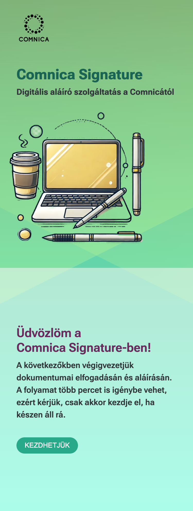

# Responsive Landing Page

This project is a responsive landing page built using React, TypeScript, and Vite. The page is designed to adapt across multiple screen sizes and works seamlessly on desktop, tablet, and mobile devices.

## Tech Stack

- React: Frontend UI library for building the page.
- TypeScript: For type safety and better development experience.
- Vite: Fast and lightweight development build tool.
- CSS/SCSS: Styling the components with a modular approach.

## Setup

1. Clone the repository
2. Install the dependencies with `npm install`
3. Run the app from the terminal with `npm run dev`

## Users with colors function

The fetch users with colors function is under the fetchUsers folder.

## Questions

### 2. Adott egy gomb. Elvileg minden rendben kód szinten, mégsem csinál semmit se hover, se egyéb eseményre (nem disabled). Mi lehet a probléma, mi okozhat ilyen jelenséget?

Az első gondolatom, hogy a js ki van kapcsolva, de ez nem magyarázza meg a hover hiányát.
A következtőket tartom még elképzelhetőnek:

- pointer eventek ki vannak kapcsolva a gombon
- esetleg egy átlátszó elem kitakarja a gombot

### 3. Írj egy tetszőleges JS funkciót, ami lekér egy felhasználó listát egy képzeletbeli API-ról, majd miután ezt sikerrel megtette, lekér egy szín listát, majd miután ez is sikerült, egy tetszőleges színt rendel a 1-1 felhasználóhoz és így adja vissza a felhasználók listáját. Hiba esetén a console-ra ír illetve eredménytől függetlenül a console-ra írja, ha végzett.

A fetchUsers mappában található

### 4. A designer a következőképpen álmodja meg a beviteli mező működését

A felvetés technikailag megvalósítható (CSS pozícionálással, a labelt abszolút pozicionáljuk és mozgatjuk az input field státusza szerint), azonban felhasználói élmény szempontjábol némileg aggályos:

- Eltér az iparági szokásoktól (a label általában a form fild felett van, vagy ha a material designra gondolunk, ha aktív lesz a form a label kikerül a fieldből)
- Zavarossá teszi a felületet, túlzsúfolt hatást kelt az input fielden belül.
- Akadálymentesítés szemponjából kérdéses a használata, a fent említett zavarosság nehezíti a gyengénlátók eligazodását formon
- Vizuális hierarchia szintjén is kérdéseket vet fel a kialakítás, a label tűnik az elsődleges tartalomnak és nem válik el rendesen a beviteli értéktől

