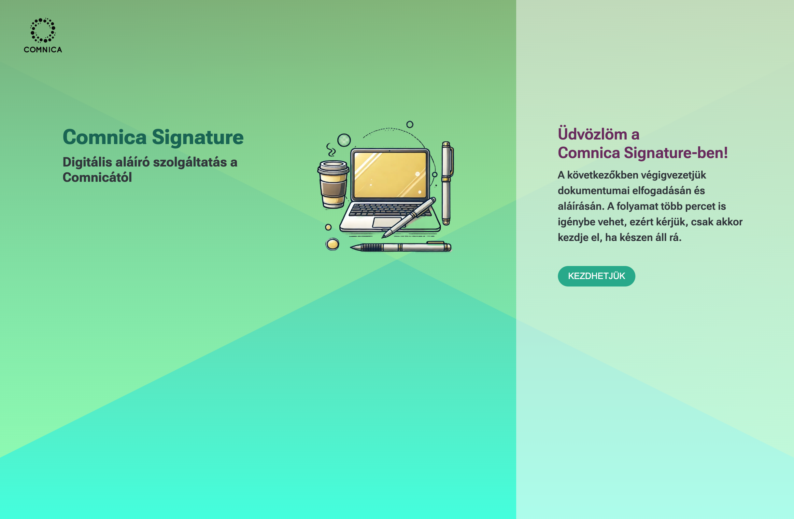
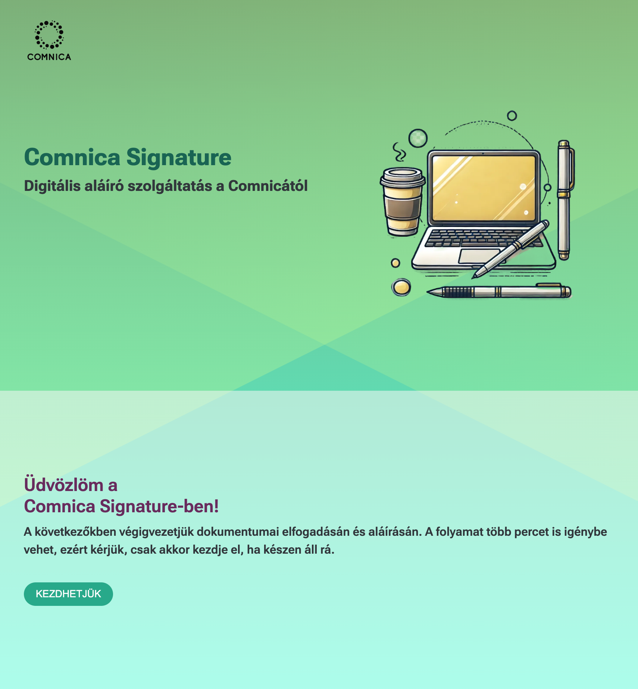

# Responsive Landing Page

This project is a responsive landing page built using React, TypeScript, and Vite. The page is designed to adapt across multiple screen sizes and works seamlessly on desktop, tablet, and mobile devices.

## Tech Stack

React: Frontend UI library for building the page.
TypeScript: For type safety and better development experience.
Vite: Fast and lightweight development build tool.
CSS/SCSS: Styling the components with a modular approach.

## Setup

1. Clone the repository
2. Install the dependencies with `npm install`
3. Run the app from the terminal with `npm run dev`

